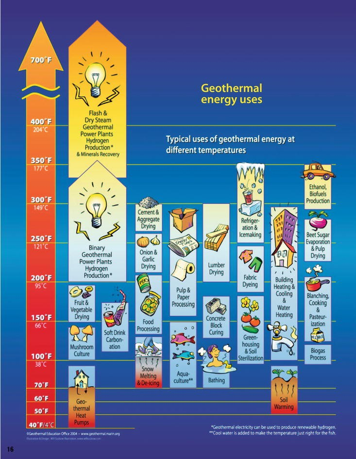
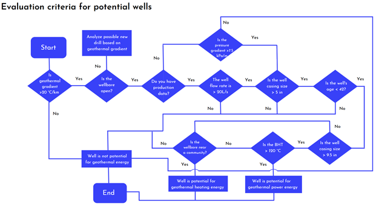

## Business Case
Geothermal Energy is natural heat from the earth which for centuries was used for bathing, heating, and cooking but is now used to produce electricity , heat/cool buildings and cultivate agricultural produce. Geothermal power is considered a sustainable renewable energy source. All methods to extract this power require drilling multiple boreholes into the earth and cycling fluid through them by a power plant. Drilling accounts for more than half the capital costs, which are already significant. Therefore, there is strong interest to re-purpose already existing oil and gas wells, thereby reducing costs, surface infrastructure and CO2 reductions.

The challenge for this event was two fold. Given data from O&G wells,
  1. Predict actual static borehole bottom hole temperatures (BHT).
  2. Recommend what wells may be suitable for geothermal power development.

## Table of Contents  
  1. [Background Information](#background-information)  
      a. [Geothermal Energy](#geothermal-energy)   
      b. [Datathon Preparation](#datathon-preparation)   
      c. [Problem Statement](#problem-statement)   
  2. [Data and Software](#data-and-software)  
      a. [The Dataset](#the-dataset)    
      b. [Software and Packages](#software-and-packages)  
      c. [Import and Organize Data](#import-and-organize-data)  
  3. [Exploratory Data Analysis (EDA)](#exploratory-data-analysis)  
  4. [Modeling](#modeling)  
      a. [Feature Selection and Engineering](#feature-selection-and-engineering)  
      b. [Modeling and Evaluation](#modeling-and-evaluation)  
  5. [Model Results](#model-results)  
      a. [Model Result](#model-result)  
      b. [Model Application](#model-application)  
  6. [Results and Recommendations](#results-and-recommendations)  
      a. [Recommended Wells](#recommended-wells)  
      b. [Insights](#insights)  
      c. [Future Recommendations](#future-recommendations)  
    
<a name="headers"/>

## Background Information

### Geothermal Energy
[Geothermal Energy](https://en.wikipedia.org/wiki/Geothermal_energy) is the natural heat of the Earth derived from the decay of the radioactive elements in the Earth’s crust and transferred to the subsurface by conduction and convection. Temperatures at the core–mantle boundary may reach over 4000 °C (7200 °F) and the crust can get up to 370 °C (700 °F).  
For centuries, [geothermal springs](https://www.geothermal-energy.org/explore/what-is-geothermal/) have been used for bathing, heating, and cooking. But in the early 20th century people started to consider geothermal as a practical source of energy with enormous potential. Geothermal energy is now used to produce electricity (Figure 1), heat and cool buildings as well as other industrial purposes like fruit and vegetable cultivation (Figure 2).  
Geothermal power (electrical power generated from geothermal energy) is considered a sustainable and renewable source of energy because the heat extraction is minor compared with the earth's heat content. Internal thermal energy from the earth flows to the surface by conduction at a rate of 44.2 terawatts (TW) and is replenished by radioactive decay of minerals at a rate of 30 TW. Compared to the world’s total energy consumption of 13 TWY, geothermal power could supply the world’s energy needs however, most of this energy flow is not recoverable.  
[Technologies to extract geothermal power](https://www.eia.gov/energyexplained/geothermal/geothermal-power-plants.php) include (Figure 1): 
  * **Dry steam plants:** Use steam directly from a geothermal reservoir to turn generator turbines. 
  * **Flash steam plants:** Take high-pressure hot water from deep inside the earth and convert it to steam to drive generator turbines. When the steam cools, it condenses to water and is injected back into the ground to be used again. 
  * **Binary cycle plants:** Transfer the heat from geothermal hot water to another liquid. The heat causes the second liquid to turn to steam, which is used to drive a generator turbine. 

  
*Figure 1: [Three types of geothermal power technologies](https://www.fuergy.com/media/pages/blog/geothermal-energy-the-clean-renewable-energy-hidden-inside-our-planet/3414410348-1594333627/power-plant-types.png)*

All these methods require that multiple boreholes be drilled into the earth to access the heat reservoir. A power plant must have production wells to bring the hot fluid (steam or hot water) to the surface and injection wells to pump the liquid back into the reservoir after it has passed through the power plant. [Capital costs](https://en.wikipedia.org/wiki/Geothermal_energy#Economics) are significant with drilling costs accounting for over half the costs. In total, electrical plant construction and well drilling cost about $2.5–6 million USD per MW of electrical capacity. For lower temperatures, geothermal energy can range from residential heat/cooling to industrial processes (Figure 2) 

  
*Figure 2: Geothermal Energy Uses (from Joseph Battir, GTX2021 presentation)*

With drilling costs being such a factor, there is strong interest in re-purposing oil and gas wells into a source of geothermal energy. The benefits are cost reduction, reducing the surface infrastructure by repurposing already existing, and conversion from high CO2 to low CO2 energy source. 

### Datathon Preparation: 
This datathon was organized to crowd source solutions to the challenge of re-purposing oil & gas wells for geothermal power. In preparation for the datathon a series of webinars were offered to help with understanding the geothermal problem and the tools necessary for a machine learning solution. These included: 
  * Geothermal 101 
  * Data Engineering 
  * Using Integra cloud services for EDA and ML (2 workshops) 
  * Machine Learning (2 workshops) 
  * Data Modelling (2 workshops) 
  * Neural Networks 
  * Model Evaluation 
  * Data Management using GIT 
  * Data Story Telling 

### Problem Statement  
Two parameters are important in the evaluation of geothermal potential in oil and gas wells:   
  1. **Formation Temperature:** The higher the temperature at bottom, the higher the potential for Geothermal use. Despite the abundance of techniques for collecting drilling and well operation data, they do not necessarily provide the real Bottom Hole Temperature (BHT).  
  2. **Flow rate:** Flow rate determines the amount of fluid that can flow naturally or be pumped through the formation or pipe. Higher permeability formations or larger diameter pipe are more viable for Geothermal purposes.  

**_The challenge_** for this event is to predict borehole bottom hole temperatures (BHT). Models were scored using Mean Absolute Error (MAE). The second part of the challenge is to recommend what wells/areas may be suitable for geothermal power development. The predicted BHT and the provided well information will form that basis of that recommendation.  

## Data and Software

### The Dataset 
We were provided with relevant oil and gas well data from two basins:  Duvernay in Alberta, Canada and Eaglebine in Texas, USA. An overview of the data is provided below: 
  * **True Temperature Train:** True Temperature data at multiple depths provided by data vendors derived using their proprietary methods. The prediction output (y variable) is the true temperature at bottom hole depth of the well. 
  * **Static Temperature logs:** Actual static formation temperatures for some wells recorded at bottom hole. In cases where this is available, this will be the prediction output (y variable). 
  * **Formation Tops:** Geologic formations and their Subsea depth for a particular well.  
  * **Well Headers:** Meta data related to the most important parameters of the wells including surface/bottom hole Latitude/Longitude, elevation, and total depths (TD). 
  * **Production Summary:** Production parameters related to a well including first production dates, total and maximum production (Oil/Gas/Water). 
  * **Mud Image Log:** Mud log files in TIF digital format. 
  * **Well Log files:** Digitalized well logs for each well in LAS format. Common well logs in each file are Gamma ray, Neutron Porosity, Density, etc.  
  * **DST Temperature and Pressure (Duvernay only):** Temperature and pressure measurements taken with Drill Stem Tests (DST) while drilling. This includes metadata related to the DST.  
  * **BHT TSC (Eaglebine only):** Bottom hole temperatures (BHT) plus Time Since Circulation information (TSC, elapsed time since last circulation before temperature was measured). 
  * **Casing & Production Summary (Eaglebine only):** Minimum casing size, completion and spud dates and cumulative oil/gas/water volumes. 
  * **Mud Weights (Eaglebine only):** Depths and mud weights in pounds per gallon (ppg). 

  
Click to expand full data dictionary

Number | Basin | File name | Field name | Definition / Description
---- | ---- | ---- | ---- | ----
1 | Duverney | Duvernay DST Pressures SPE May 2 2021 | Well ID | Unique ID of well
2 | Duverney | Duvernay DST Pressures SPE May 2 2021 | KB Elev (m) | Kelly Bushing elevation above reference datum (ground or mean sea level)
3 | Duverney | Duvernay DST Pressures SPE May 2 2021 | DST Number | Drill stem testing (DST) sequence number per formation
4 | Duverney | Duvernay DST Pressures SPE May 2 2021 | Formation DSTd | Formation DST was performed in
5 | Duverney | Duvernay DST Pressures SPE May 2 2021 | DST Start Depth (TVD) (m) | Top depth of DST section (TVD)
6 | Duverney | Duvernay DST Pressures SPE May 2 2021 | DST End Depth (TVD) (m) | Bottom depth of DST section (TVD)
7 | Duverney | Duvernay DST Pressures SPE May 2 2021 | DST Start Depth (MD) (m) | Top depth of DST section (measured depth)
8 | Duverney | Duvernay DST Pressures SPE May 2 2021 | DST End Depth (MD) (m) | Bottom depth of DST section (measured depth)
9 | Duverney | Duvernay DST Pressures SPE May 2 2021 | DST Test Date | Date DST test performed
10 | Duverney | Duvernay DST Pressures SPE May 2 2021 | Test Type | Type of DST test performed (DST, WLT, LRT)
11 | Duverney | Duvernay DST Pressures SPE May 2 2021 | DST Misrun | DST failure (Y or N)
12 | Duverney | Duvernay DST Pressures SPE May 2 2021 | Misrun Problem Type | DST failure type
13 | Duverney | Duvernay DST Pressures SPE May 2 2021 | 1st Valve Open Time | Time in minutes valve is opened on first test
14 | Duverney | Duvernay DST Pressures SPE May 2 2021 | 2nd Valve Open Time | Time in minutes valve is opened on second test
15 | Duverney | Duvernay DST Pressures SPE May 2 2021 | 3rd Valve Open Time | Time in minutes valve is opened on third test
16 | Duverney | Duvernay DST Pressures SPE May 2 2021 | 1st Shut-in Time | Time in minutes valve is shut in on first test
17 | Duverney | Duvernay DST Pressures SPE May 2 2021 | 2nd Shut-in Time | Time in minutes valve is shut in on second test
18 | Duverney | Duvernay DST Pressures SPE May 2 2021 | 3rd Shut-in Time | Time in minutes valve is shut in on third test
19 | Duverney | Duvernay DST Pressures SPE May 2 2021 | Pressure Recorder Depth (m) | Depth of pressure sensor relative to datum
20 | Duverney | Duvernay DST Pressures SPE May 2 2021 | DST Bottom Hole Temp. (degC) | Bottom hole temperature recorded on DST tool
21 | Duverney | Duvernay DST Pressures SPE May 2 2021 | Initial Hydrostatic Pressure (kPa) | Initial Hydrostatic Pressure at start of DST
22 | Duverney | Duvernay DST Pressures SPE May 2 2021 | Final Hydrostatic Pressure (kPa) | Initial Hydrostatic Pressure at end of DST
23 | Duverney | Duvernay DST Pressures SPE May 2 2021 | 1st Flow Pressure (kPa) | Flowing pressure on first valve open test
24 | Duverney | Duvernay DST Pressures SPE May 2 2021 | 2nd Flow Pressure (kPa) | Flowing pressure on second valve open test
25 | Duverney | Duvernay DST Pressures SPE May 2 2021 | 3rd Flow Pressure (kPa) | Flowing pressure on third valve open test
26 | Duverney | Duvernay DST Pressures SPE May 2 2021 | 1st Shut-in Pressure (kPa) | Shut in pressure on first shut in test
27 | Duverney | Duvernay DST Pressures SPE May 2 2021 | 1st Shut-in Initial Slope | Shut in pressure on second valve shut in test
28 | Duverney | Duvernay DST Pressures SPE May 2 2021 | 1st Shut-in Final Slope | Shut in pressure on third valve shut in test
29 | Duverney | Duvernay DST Pressures SPE May 2 2021 | 1st Shut-in Extrapolated Press (kPa) | Extrapolated pressure from measurements in first shut in test
30 | Duverney | Duvernay DST Pressures SPE May 2 2021 | 2nd Shut-in Pressure (kPa) | Shut in pressure on second valve shut in test
31 | Duverney | Duvernay DST Pressures SPE May 2 2021 | 2nd Shut-in Initial Slope | Initial recorded pressure slope of second shut in test
32 | Duverney | Duvernay DST Pressures SPE May 2 2021 | 2nd Shut-in Final Slope | Final recorded pressure slope of second shut in test
33 | Duverney | Duvernay DST Pressures SPE May 2 2021 | 2nd Shut-in Extrapolated Press (kPa) | Extrapolated pressure from measurements in second shut in test
34 | Duverney | Duvernay DST Pressures SPE May 2 2021 | 3rd Shut-in Pressure (kPa) | Shut in pressure on third valve shut in test
35 | Duverney | Duvernay DST Pressures SPE May 2 2021 | 3rd Shut-in Initial Slope | Initial recorded pressure slope of third shut in test
36 | Duverney | Duvernay DST Pressures SPE May 2 2021 | 3rd Shut-in Final Slope | Final recorded pressure slope of third shut in test
37 | Duverney | Duvernay DST Pressures SPE May 2 2021 | 3rd Shut-in Extrapolated Press (kPa) | Extrapolated pressure from measurements in third shut in test
38 | Duverney | Duvernay DST Pressures SPE May 2 2021 | Maximum Shut-in Pressure (kPa) | Maximum recorded pressure from DST shut in tests
42 | Duverney | Duvernay DST BHT for SPE April 20 2021 | Well ID | Unique ID of well
43 | Duverney | Duvernay DST BHT for SPE April 20 2021 | DST Start Depth (MD) (m) | Top depth of DST section (measured depth)
44 | Duverney | Duvernay DST BHT for SPE April 20 2021 | DST End Depth (MD) (m) | Bottom depth of DST section (measured depth)
45 | Duverney | Duvernay DST BHT for SPE April 20 2021 | DST Bottom Hole Temp. (degC) | Bottom hole temperature recorded on DST tool
46 | Duverney | Duvernay DST BHT for SPE April 20 2021 | DST Test Date | Date DST test performed
47 | Duverney | Duvernay DST BHT for SPE April 20 2021 | Test Type | Type of DST test performed (DST, WLT, LRT)
48 | Duverney | Duvernay DST BHT for SPE April 20 2021 | DST Misrun | DST failure (Y or N)
49 | Duverney | Duvernay DST BHT for SPE April 20 2021 | DST Number | DST sequence number per formation
50 | Duverney | Duvernay DST BHT for SPE April 20 2021 | Formation DSTd | Formation DST was performed in
51 | Duverney | Duvernay DST BHT for SPE April 20 2021 | elevation M above sea level | Elevation measurement above mean sea level
52 | Duverney | Duvernay DST BHT for SPE April 20 2021 | UWI | Unique well Identifier
53 | Duverney | Duvernay formation tops SPE April 20 2021 | UWI | Unique well Identifier
54 | Duverney | Duvernay formation tops SPE April 20 2021 | Bottom Hole Location X_m_NAD27_Zone 11N (120 W to 114 W) | X coordinates
55 | Duverney | Duvernay formation tops SPE April 20 2021 | Bottom Hole Location Y_m_NAD27_Zone 11N (120 W to 114 W) | Y coordinates
56 | Duverney | Duvernay formation tops SPE April 20 2021 | Elevation(m above sea level) | Elevation measurement above mean sea level
57 | Duverney | Duvernay formation tops SPE April 20 2021 | 01_Battle (Surbiton)[SSTVD] (m) | Top depth of named Formation per well, measured vertically from sea level
58 | Duverney | Duvernay formation tops SPE April 20 2021 | 02_Lea_Park (Surbiton)[SSTVD] (m) | Top depth of named Formation per well, measured vertically from sea level
59 | Duverney | Duvernay formation tops SPE April 20 2021 | 03_1st_White_Speckled_Shale (Surbiton)[SSTVD] (m) | Top depth of named Formation per well, measured vertically from sea level
60 | Duverney | Duvernay formation tops SPE April 20 2021 | 04_2nd_White_Speckled_Shale (Surbiton)[SSTVD] (m) | Top depth of named Formation per well, measured vertically from sea level
61 | Duverney | Duvernay formation tops SPE April 20 2021 | 05_Fish_scales (Surbiton)[SSTVD] (m) | Top depth of named Formation per well, measured vertically from sea level
62 | Duverney | Duvernay formation tops SPE April 20 2021 | 06_Mannville_Top (Surbiton)[SSTVD] (m) | Top depth of named Formation per well, measured vertically from sea level
63 | Duverney | Duvernay formation tops SPE April 20 2021 | 07_Ostracod_Beds (Surbiton)[SSTVD] (m) | Top depth of named Formation per well, measured vertically from sea level
64 | Duverney | Duvernay formation tops SPE April 20 2021 | 08_Jurassic_Top (Surbiton)[SSTVD] (m) | Top depth of named Formation per well, measured vertically from sea level
65 | Duverney | Duvernay formation tops SPE April 20 2021 | 09_Montney_Top (Surbiton)[SSTVD] (m) | Top depth of named Formation per well, measured vertically from sea level
66 | Duverney | Duvernay formation tops SPE April 20 2021 | 10_Permian_Top (Surbiton)[SSTVD] (m) | Top depth of named Formation per well, measured vertically from sea level
67 | Duverney | Duvernay formation tops SPE April 20 2021 | 11_Wabamun (Surbiton)[SSTVD] (m) | Top depth of named Formation per well, measured vertically from sea level
68 | Duverney | Duvernay formation tops SPE April 20 2021 | 12_Winterburn (Surbiton)[SSTVD] (m) | Top depth of named Formation per well, measured vertically from sea level
69 | Duverney | Duvernay formation tops SPE April 20 2021 | 13_Woodbend (Surbiton)[SSTVD] (m) | Top depth of named Formation per well, measured vertically from sea level
70 | Duverney | Duvernay formation tops SPE April 20 2021 | 14_Duvernay_Top (Surbiton)[SSTVD] (m) | Top depth of named Formation per well, measured vertically from sea level
71 | Duverney | Duvernay formation tops SPE April 20 2021 | 15_Beaverhill (Surbiton)[SSTVD] (m) | Top depth of named Formation per well, measured vertically from sea level
72 | Duverney | Duvernay formation tops SPE April 20 2021 | 16_Elk_Point (Surbiton)[SSTVD] (m) | Top depth of named Formation per well, measured vertically from sea level
73 | Duverney | Duvernay formation tops SPE April 20 2021 | 17_Precambrian Basement (Surbiton)[SSTVD] (m) | Top depth of named Formation per well, measured vertically from sea level
74 | Duverney | Duvernay well headers SPE April 21 2021  | UWI  | Unique well Identifier
75 | Duverney | Duvernay well headers SPE April 21 2021  | Elevation Meters | Elevation measurement above mean sea level
76 | Duverney | Duvernay well headers SPE April 21 2021  | ElevationDatum | Elevation measurement point (Kelly Bushing)
77 | Duverney | Duvernay well headers SPE April 21 2021  | TD meters  | Total Depth of the well measured along the borehole in meters
78 | Duverney | Duvernay well headers SPE April 21 2021  | SurfaceLatitude_NAD83 | Latitude of well at surface, North American Datum of 1983
79 | Duverney | Duvernay well headers SPE April 21 2021  | SurfaceLongitude_NAD83 | Longitude of well at surface, North American Datum of 1983
80 | Duverney | Duvernay well headers SPE April 21 2021  | BottomLatitude_NAD83 | Latitude of well at bottom, North American Datum of 1983
81 | Duverney | Duvernay well headers SPE April 21 2021  | BottomLongitude_NAD83 | Longitude of well at bottom, North American Datum of 1983
82 | Duverney | Duvernay well headers SPE April 21 2021  | SurfaceLatitude_NAD27 | Latitude of well at surface, North American Datum of 1927 
83 | Duverney | Duvernay well headers SPE April 21 2021  | SurfaceLongitude_NAD27 | Longitude of well at surface, North American Datum of 1927 
84 | Duverney | Duvernay well headers SPE April 21 2021  | BottomLatitude_NAD27 | Latitude of well at bottom, North American Datum of 1927 
85 | Duverney | Duvernay well headers SPE April 21 2021  | BottomLongitude_NAD27 | Longitude of well at bottom, North American Datum of 1927 
86 | Duverney | SPE Duvernay production summary April 20 2021 | API    | Unique API number (US wells)
87 | Duverney | SPE Duvernay production summary April 20 2021 | Measured Depth (ft)    | Overall depth of a well - length of the well bore
88 | Duverney | SPE Duvernay production summary April 20 2021 | Total Vertical Depth (ft)    | Vertical distance from the bottom of the well to surface
89 | Duverney | SPE Duvernay production summary April 20 2021 | Spud Date    | The date when drilling began for the well
90 | Duverney | SPE Duvernay production summary April 20 2021 | Completion Date    | The date when well was completed
91 | Duverney | SPE Duvernay production summary April 20 2021 | First Production Month    | Month when the first production from the well was reported
92 | Duverney | SPE Duvernay production summary April 20 2021 | Elevation    | Elevation measured above a certain datum (ground or mean sea level)
93 | Duverney | SPE Duvernay production summary April 20 2021 | Oil Total Cum (bbl)    | Cumulative Oil Production at the time of reporting this data
94 | Duverney | SPE Duvernay production summary April 20 2021 | Gas Total Cum (mcf)    | Cumulative Gas Production at the time of reporting this data
95 | Duverney | SPE Duvernay production summary April 20 2021 | Water Total Cum (bbl)    | Cumulative Water Production at the time of reporting this data
96 | Duverney | SPE Duvernay production summary April 20 2021 | GOR Total Average    | Gas Oil Ratio
97 | Duverney | SPE Duvernay production summary April 20 2021 | Plug Date    | If the well reached the abondanment limit then when was it plugged
98 | Duverney | SPE Duvernay production summary April 20 2021 | First Production Date    | Date when the first production from the well was reported
99 | Duverney | SPE Duvernay production summary April 20 2021 | Elevation Drill Floor (ft)    | Elevation of drill floor above mean sea level
100 | Duverney | SPE Duvernay production summary April 20 2021 | Elevation Ground (ft)    | Elevation of ground level above mean sea level
101 | Duverney | SPE Duvernay production summary April 20 2021 | Elevation Kelly Bushing (ft)    | Elevation of kelly bushing above mean sea level
102 | Duverney | SPE Duvernay production summary April 20 2021 | Last Production Month    | The last production month reported
103 | Duverney | SPE Duvernay production summary April 20 2021 | Gas Maximum (mcf)    | Maximum amount of gas production at one time
104 | Duverney | SPE Duvernay production summary April 20 2021 | Gas Maximum Date    | Date the maximum gas production was recorded
105 | Duverney | SPE Duvernay production summary April 20 2021 | Oil Maximum (bbl)    | Maximum amount of oil production at one time
106 | Duverney | SPE Duvernay production summary April 20 2021 | Oil Maximum Date    | Date the maximum oil production was recorded
107 | Duverney | SPE Duvernay production summary April 20 2021 | Water Maximum (bbl)    | Maximum amount of water production at one time
108 | Duverney | SPE Duvernay production summary April 20 2021 | Water Maximum Date    | Date the maximum water production was recorded
109 | Duverney | SPE Duvernay production summary April 20 2021 | Yield Total Average    | Oil and Gas production versus total production
110 | Eaglebine | Eaglebine BHT TSC data for SPE April 21 2020 | UWI | Unique well Identifier
111 | Eaglebine | Eaglebine BHT TSC data for SPE April 21 2020 | SurfLat | Latitude coordinate of well at surface
112 | Eaglebine | Eaglebine BHT TSC data for SPE April 21 2020 | SurfLong | Longitude coordinate of well at surface
113 | Eaglebine | Eaglebine BHT TSC data for SPE April 21 2020 | TD (ft) | Total Depth of the well measured along the borehole in feet
114 | Eaglebine | Eaglebine BHT TSC data for SPE April 21 2020 | GL(ft) | Ground Level (from mean sea level)
115 | Eaglebine | Eaglebine BHT TSC data for SPE April 21 2020 | BHT_below sea level (ft) | Bottom Hole Temperature in the wellbore measured from sea level depth
116 | Eaglebine | Eaglebine BHT TSC data for SPE April 21 2020 | BHT_ subsurface (ft) | Bottom Hole Temperature in the wellbore measured from ground level depth
117 | Eaglebine | Eaglebine BHT TSC data for SPE April 21 2020 | BHTorMRT (maximum recorded temperature) oF | Bottom hole temperature or Maximum recorded Temperature
118 | Eaglebine | Eaglebine BHT TSC data for SPE April 21 2020 | TSC or ORT (time since circulation or original recorded time in hours) | Time since circulation
119 | Eaglebine | EagleBine Casing production summary for SPE April21 2020 | UWI | Unique well Identifier
120 | Eaglebine | EagleBine Casing production summary for SPE April21 2020 | MinCasingSize\ | The minimum casing size for a well
121 | Eaglebine | EagleBine Casing production summary for SPE April21 2020 | spuddate | The date when drilling begins for a well
122 | Eaglebine | EagleBine Casing production summary for SPE April21 2020 | completiondate | The date when well was completed
123 | Eaglebine | EagleBine Casing production summary for SPE April21 2020 | cumoil | Cumulative Oil Production at the time of reporting this data
124 | Eaglebine | EagleBine Casing production summary for SPE April21 2020 | cumgas | Cumulative Gas Production at the time of reporting this data
125 | Eaglebine | EagleBine Casing production summary for SPE April21 2020 | cumwater | Cumulative Water Production at the time of reporting this data
129 | Eaglebine | Eaglebine formation tops SPE April 20 2021 | UWI | Unique well Identifier
130 | Eaglebine | Eaglebine formation tops SPE April 20 2021 | Bottom_Hole_Location_X | X coordinates at bottom of wellbore
131 | Eaglebine | Eaglebine formation tops SPE April 20 2021 | Bottom_Hole_Location_Y | Y coordinates at bottom of wellbore
132 | Eaglebine | Eaglebine formation tops SPE April 20 2021 | Elevation(f) | Elevation measured above a certain datum (ground or mean sea level)
133 | Eaglebine | Eaglebine formation tops SPE April 20 2021 | Elevation_Reference | Elevation measurement point (Kelly Bushing)
134 | Eaglebine | Eaglebine formation tops SPE April 20 2021 | Latitude | Latitude coordinate
135 | Eaglebine | Eaglebine formation tops SPE April 20 2021 | Longitude | Longitude coordinate
136 | Eaglebine | Eaglebine formation tops SPE April 20 2021 | Total_Depth(f) | Total Depth of the well measured along the borehole in feet
137 | Eaglebine | Eaglebine formation tops SPE April 20 2021 | X(f) | X coordinates
138 | Eaglebine | Eaglebine formation tops SPE April 20 2021 | Y(f) | Y coordinates 
139 | Eaglebine | Eaglebine formation tops SPE April 20 2021 | 01_Wilcox_MD_ft | Top depth of named Formation per well, measured along the wellbore in feet
140 | Eaglebine | Eaglebine formation tops SPE April 20 2021 | 02_Midway_MD_ft | Top depth of named Formation per well, measured along the wellbore in feet
141 | Eaglebine | Eaglebine formation tops SPE April 20 2021 | 03_Navarro_MD_ft | Top depth of named Formation per well, measured along the wellbore in feet
142 | Eaglebine | Eaglebine formation tops SPE April 20 2021 | 04_Taylor_MD_ft | Top depth of named Formation per well, measured along the wellbore in feet
143 | Eaglebine | Eaglebine formation tops SPE April 20 2021 | 05_Anacacho_MD_ft | Top depth of named Formation per well, measured along the wellbore in feet
144 | Eaglebine | Eaglebine formation tops SPE April 20 2021 | 06_Austin_Chalk_MD_ft | Top depth of named Formation per well, measured along the wellbore in feet
145 | Eaglebine | Eaglebine formation tops SPE April 20 2021 | 07_Upper_Eagle_Ford_MD_ft | Top depth of named Formation per well, measured along the wellbore in feet
146 | Eaglebine | Eaglebine formation tops SPE April 20 2021 | 08_Lower_Eagle_Ford_MD_ft | Top depth of named Formation per well, measured along the wellbore in feet
147 | Eaglebine | Eaglebine formation tops SPE April 20 2021 | 09_Woodbine_MD_ft | Top depth of named Formation per well, measured along the wellbore in feet
148 | Eaglebine | Eaglebine formation tops SPE April 20 2021 | 10_Maness_MD_ft | Top depth of named Formation per well, measured along the wellbore in feet
149 | Eaglebine | Eaglebine formation tops SPE April 20 2021 | 11_Buda_MD_ft | Top depth of named Formation per well, measured along the wellbore in feet
150 | Eaglebine | Eaglebine formation tops SPE April 20 2021 | 12_Del_Rio_MD_ft | Top depth of named Formation per well, measured along the wellbore in feet
151 | Eaglebine | Eaglebine formation tops SPE April 20 2021 | 13_Georgetown_MD_ft | Top depth of named Formation per well, measured along the wellbore in feet
152 | Eaglebine | Eaglebine formation tops SPE April 20 2021 | 14_Edwards_MD_ft | Top depth of named Formation per well, measured along the wellbore in feet
153 | Eaglebine | Eaglebine formation tops SPE April 20 2021 | 15_Glen_Rose_MD_ft | Top depth of named Formation per well, measured along the wellbore in feet
154 | Eaglebine | Eaglebine formation tops SPE April 20 2021 | 16_Pearsal_MD_ft | Top depth of named Formation per well, measured along the wellbore in feet
155 | Eaglebine | Eaglebine formation tops SPE April 20 2021 | 17_James_Cow_Creek_MD_ft | Top depth of named Formation per well, measured along the wellbore in feet
156 | Eaglebine | Eaglebine formation tops SPE April 20 2021 | 18_Sligo_MD_ft | Top depth of named Formation per well, measured along the wellbore in feet
157 | Eaglebine | Eaglebine formation tops SPE April 20 2021 | 19_Cotton_Valley_MD_ft | Top depth of named Formation per well, measured along the wellbore in feet
158 | Eaglebine | Eaglebine mud weight SPE April 21 2021 | UWI | Unique well Identifier
159 | Eaglebine | Eaglebine mud weight SPE April 21 2021 | TD | Total Depth of the well measured along the borehole in feet
160 | Eaglebine | Eaglebine mud weight SPE April 21 2021 | KB | Kelly Bushing
161 | Eaglebine | Eaglebine mud weight SPE April 21 2021 | Mud Wt | Weight of drilling fluid
162 | Eaglebine | Eaglebine mud weight SPE April 21 2021 | MW@Depth(KB) | Depth at which mud weight is measured
163 | Eaglebine | Eaglebine well headers SPE April 21 2021 | td | Total Depth of the well measured along the borehole
164 | Eaglebine | Eaglebine well headers SPE April 21 2021 | Elevation | Elevation measured above a certain datum (ground or mean sea level)
165 | Eaglebine | Eaglebine well headers SPE April 21 2021 | ElevationDatum | Elevation measurement point (Kelly Bushing)
166 | Eaglebine | Eaglebine well headers SPE April 21 2021 | displayapi | Unique API number (US wells)
167 | Eaglebine | Eaglebine well headers SPE April 21 2021 | WGS84Latitude | World Geodetic System (WGS84) easting coordinates
168 | Eaglebine | Eaglebine well headers SPE April 21 2021 | WGS84Longitude | World Geodetic System (WGS84) northing coordinates
169 | Eaglebine | Eaglebine well headers SPE April 21 2021 | SurfLat | Latitude coordinate of well at surface
170 | Eaglebine | Eaglebine well headers SPE April 21 2021 | SurfLong | Longitude coordinate of well at surface
171 | Eaglebine | Eaglebine well headers SPE April 21 2021 | SurfaceLatitude_NAD83 | Latitude of well at surface, North American Datum of 1983
172 | Eaglebine | Eaglebine well headers SPE April 21 2021 | SurfaceLongitude_NAD83 | Longitude of well at surface, North American Datum of 1983
173 | Eaglebine | Eaglebine well headers SPE April 21 2021 | BottomLatitude_NAD83 | Latitude of well at bottom, North American Datum of 1983
174 | Eaglebine | Eaglebine well headers SPE April 21 2021 | BottomLongitude_NAD83 | Longitude of well at bottom, North American Datum of 1983
175 | Eaglebine | Eaglebine well headers SPE April 21 2021 | SurfaceLatitude_NAD27 | Latitude of well at surface, North American Datum of 1927 
176 | Eaglebine | Eaglebine well headers SPE April 21 2021 | SurfaceLongitude_NAD27 | Longitude of well at surface, North American Datum of 1927 
177 | Eaglebine | Eaglebine well headers SPE April 21 2021 | BottomLatitude_NAD27 | Latitude of well at bottom, North American Datum of 1927 
178 | Eaglebine | Eaglebine well headers SPE April 21 2021 | BottomLongitude_NAD27 | Longitude of well at bottom, North American Datum of 1927 
179 | Eaglebine | SPE Eaglebine production summary April 20 2021 | API    | Unique API number (US wells)
180 | Eaglebine | SPE Eaglebine production summary April 20 2021 | Measured Depth (ft)    | Total Depth of the well measured along the borehole in feet
181 | Eaglebine | SPE Eaglebine production summary April 20 2021 | Total Vertical Depth (ft)    | Vertical distance from the bottom of the well to surface in feet
182 | Eaglebine | SPE Eaglebine production summary April 20 2021 | Spud Date    | The date when drilling began for the well
183 | Eaglebine | SPE Eaglebine production summary April 20 2021 | Completion Date    | The date when well was completed
184 | Eaglebine | SPE Eaglebine production summary April 20 2021 | First Production Month    | Month when the first production from the well was reported
185 | Eaglebine | SPE Eaglebine production summary April 20 2021 | Elevation    | Elevation measured above a certain datum (ground or mean sea level)
186 | Eaglebine | SPE Eaglebine production summary April 20 2021 | Oil Total Cum (bbl)    | Cumulative Oil Production at the time of reporting this data
187 | Eaglebine | SPE Eaglebine production summary April 20 2021 | Gas Total Cum (mcf)    | Cumulative Gas Production at the time of reporting this data
188 | Eaglebine | SPE Eaglebine production summary April 20 2021 | Water Total Cum (bbl)    | Cumulative Water Production at the time of reporting this data
189 | Eaglebine | SPE Eaglebine production summary April 20 2021 | GOR Total Average    | Gas Oil Ratio
190 | Eaglebine | SPE Eaglebine production summary April 20 2021 | Plug Date    | If the well reached the abondanment limit then when was it plugged
191 | Eaglebine | SPE Eaglebine production summary April 20 2021 | TD Date    | Date when drilling got to the bottom depth of the well
192 | Eaglebine | SPE Eaglebine production summary April 20 2021 | Drilling Days    | Number of days it took to drill the well
193 | Eaglebine | SPE Eaglebine production summary April 20 2021 | Last Production Month    | The last production month reported
194 | Eaglebine | SPE Eaglebine production summary April 20 2021 | Gas Maximum (mcf)    | Maximum amount of gas production at one time
195 | Eaglebine | SPE Eaglebine production summary April 20 2021 | Gas Maximum Date    | Date the maximum gas production was recorded
196 | Eaglebine | SPE Eaglebine production summary April 20 2021 | Oil Maximum (bbl)    | Maximum amount of oil production at one time
197 | Eaglebine | SPE Eaglebine production summary April 20 2021 | Oil Maximum Date    | Date the maximum oil production was recorded
198 | Eaglebine | SPE Eaglebine production summary April 20 2021 | Water Maximum (bbl)    | Maximum amount of water production at one time
199 | Eaglebine | SPE Eaglebine production summary April 20 2021 | Water Maximum Date    | Date the maximum water production was recorded
200 | Eaglebine | SPE Eaglebine production summary April 20 2021 | Liquid Injection Cum (bbl)    | Cumulative liquid injected into the well at the time of reporting this data
201 | Eaglebine | SPE Eaglebine production summary April 20 2021 | Gas Injection Cum (mcf)    | Cumulative gas injected into the well at the time of reporting this data

### Software and Packages 
  * Python 
  * Pandas 
  * Numpy 
  * Matplotlib 
  * Seaborn 
  * Lasio 
  * Welly 
  * Geopandas 
  * Power BI 
  * Tableau 

### Import and Organize Data 
Since the data was spread across multiple Excel, CSV, LAS and TIF image files, it had to be imported, merged, and organized in multiple steps (Figure 3) 
  1. All temperature data (2.1-2.3) 
  2. All well header, mud, formation, and production data (2.4) 
  3. All LAS logs (2.5) 
  4. Combine all datasets (2.6, creating 1160 rows, 331 columns) 
  5. Extract common logs from log data (2.7) 
  6. Extract “TSC: like values from DST (2.8) 
  7. Create final dataset with useful features (2.8, 836 rows, 22 columns)

  
*Figure 3: Final dataset (refer to data dictionary for feature details)*

## Exploratory Data Analysis 

Duvernay wells are spread across SW of Alberta from north of Airdrie to north of Slave Lake. Eaglebine wells. Eaglebine wells are spread across central Texas from SE of Waco through San Antonio to the Mexican border.

  
*Figure 4: Well location map for Duvernay basin in central Alberta*

  
*Figure 5: Well locations for Eaglebine basin in Texas.*

The dataset had a total of 836 wells: 512 Duvernay, 324 Eaglebine wells. Several statistical and wrangling methods were performed to better understand the data. Some findings are plotted below (Figure 6, 7, 8).  

  
*Figure 6: BHT vs Static/True Temperature (depth as hue): __Duvernay__*

  
*Figure 6: BHT vs Static/True Temperature (depth as hue): __Eaglebine__*

  
*Figure 8: Dataset Missing Features. Gaps in the plot shows missing values per well (y-axis = index of wells). Summary in top right corner are total numbers and percentages.*

The data preparation, cleaning, and EDA process was as follows:  
  1. Import and flatten the LAS files. Manually sort the 795 different mnemonics (wireline log name) and reduced to <10 basic log types (Neutron, Density, Sonic, Gamma Ray, Resistivity, Borehole). In addition, two LAS files for each well were provided which had to be evaluated to determine which one to use or if they required merging. 
  2. Wireline log data was handled as per the figure below. The consolidated LAS data from the above step still had missing data. We developed a system to fill in that data gaps (see figure below) using the reduced log types and averaging over a depth interval from TD. 
  3. Build lithology isopach and thermal conductivity model using the gross lithology data provided and their published thermal conductivity values.  
  4. Perform EDA and data clean of the general dataset. This included reconciling numerous TD values (total depth) from various source, determining the GL (ground level) was invalid since it should always be less than KB (kelly bushing; Figure 9) – TD (multiple, deviated vs vertical), determining each basin did not have the exact same key data types for some of the geothermal calculations (e.g., Horner extrapolation from DST). Fixed UWI (unique well identifier) errors in the Eaglebine basin. Identified problematic data like ‘completion date’ post-dating the last production date.  
  5. Identified outliers and errors in the dataset and individually assessed their validity.  
  6. Extracted new features like the surface temperature (from the LAS file) and time since circulation (from DST information) to assist in temperature and thermal gradient calculation. 

  
*Figure 9: Graphic display for some of the data wrangling process.*

## Modeling

### Feature Selection and Engineering 
Once the data had been prepared, analysis of the various features for relative importance was performed. A feature importance graph (Figure 10) and correlation matrix to the target, ‘truetemp’ (Figure 11) are provided below and were the basis for feature selection. The steps to selecting input features are as follows: 
  * Applied regression model to impute missing log values (almost 50% of Bulk density & Neutron porosity values missing), but these features did not improve model so were dropped. 
  * 26% of True Temperatures values are missing and were dropped since this is the target. 
  * Instead of removing outlier data, RobustScaler was used to normalize the data. This reduces the impact of outliers.  
  * Shut in time (time for well to equilibrate to static formation temperature) had minimal effect. 
  * Features that showed the most impact and correlation:   
    * BHT (bottomhole temperature) 
    * BHT Depth (depth of the bottomhole temperature) 
    * Total Depth (deepest part of wellbore) 
    * Latitude/Longitude 
  * Wireline data has model feature importance (Figure 10), but except for bulk density, low correlation to the target (Figure 11). Overall, their inclusion did not improve subsequent models.  
  * We noticed that the y-coordinate was highly correlated with Bulk density and so substituted it. 

  
*Figure 10: Feature importance plot (importance proportion on X-axis)*

  
*Figure 11: Correlation plot of all features vs target (truetemp)*

### Modeling and Evaluation 
  * Multiple regression models were k-fold tested to determine the best for use. Models were scored with Negative Mean Absolute Percentage Error (the lower the better). Random Forest model scored the best as seen in the plot below. 
  * Built a neural network model (CNN) but it did not perform as well and was discarded for future analysis. 
  * We also attempted to ensemble a Kriging model (a spatial interpolation model) with Random Forest, but that did not perform as well. 
  * Supervised Learning models appear to perform best and are summarized below (Figure 12)

  
*Figure 12: Box plot model comparison. Summary in top left corner = mean score and (score standard deviation). Y-axis = negative MAPE.*

## Model Results

### Model Result 
The final model selected was Random Forest. I had a combined 5.98 MAE (primary scoring criteria for competition). Individual basins had slightly varied results as shown below (Figure 13)

  
*Figure 13: Predicted vs Real BHT plot for Eaglebine and Duvernay basins. Note the difference between the two basins with respect to MAE and RMSE.*

### Model Application 
Once the temperature prediction from the model was in place, BHT and geothermal gradients (Figure 14) were predicted for all wells in the Duvernay and Eaglebine basin. With that information in place, geothermal potential could be evaluated for all wells. Our approach was to view the problem from an operating company that is looking for investment opportunities, but with limited capital. The process to create a concise list of quality geothermal candidates is as follows: 
  * Interpret results and create a brief list of action items for heating and power generation using a screening process of (see Figure 15, casing size, production volume, absolute temperature, etc.) 
  * Plot results on a map using QGIS (v3.14) with ‘OpenStreetMap’ as base layer to identify wells proximal to an ‘energy need’ (i.e., community OR power station/grid). 
  * Final presentation of results and, if any, recommended actions to take. We chose to only provide a handful of recommended wells, power and heat/cool in Eaglebine, and heating in Duvernay. With limited capital, narrowing the list allows the company to focus on just those with the highest potential.

  
*Figure 14: Comparison of geothermal gradient for all wells in Eaglebine and Duvernay basins.*

  
*Figure 15: Flow chart for screening prospective geothermal wells.*

## Results and Recommendations 

### Recommended Wells
Based on the model and the screening process outlined in the sections above, a concise list of recommended wells was created (figure 16). The Duvernay basin has three wells, all of them heating and wellbore re-entry. The Eaglebine is a mixture of heating and power. These wells could be a mixture of re-entry and new drill. The tables (Figure 17) below include the critical elements for each recommended well such as type of geothermal energy, new drill or re-entry action required, geothermal gradient, estimated costs and proximity to infrastructure or ’energy need’.

  
*Figure 16:  Map of recommended prospective geothermal wells.*

  
*Figure 17: Table listed recommended wells with key features for each recommendation including the geothermal energy type.*

### Insights 
  * Average Thermal Gradient of 25.5C/km & 32C/km for Duvernay and Eaglebine respectively, put both basins as prospective for geothermal energy, but Eaglebine would be at the low end for power generation and Duvernay is primarily heating.  
  * Geothermal energy requires high volumes of flow, therefore, casing size, well capacity and age are big factors on repurposing oil and gas wells.  
  * Abundant wellbores provide a potential advantage over most other basins, but most wells in these basins do not satisfy all or most of the above criteria such as casing diameter, expected flow rate. 
  * Industrial scale heating/cooling is the primary recommendation for the Duvernay basin. There are many suitable wellbores available to reduce the cost, but most of those wells did not appear to be sufficiently close to the ‘energy need.’ 
  * Modelling suggests BHT appeared to be highly correlated to bulk density and neutron porosity. 

### Future Recommendations 
  * Acquire cost analysis on grid connection for power plants & geothermal surface facilities 
  * Since bulk density and neutron porosity correlate to BHT, a detailed geologic/petrophysical model using core and wireline data should be created for the machine learning model. 
  * Investigate the logistics & economics of co-producing hot water & natural gas/oil to improve the value chain. 
  * Consider metal extraction (e.g., Lithium) in conjunction with geothermal energy to improve economics. 
  * Consider using different base map layers to better identify ‘energy need’ areas. 

